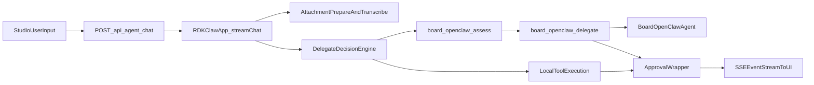

# RDKCLAW 专项深度说明（汇报稿）

## 1. RDKCLAW 的角色定义

RDKCLAW 不是单一聊天接口，而是 RDK Studio 的“任务编排内核”。它负责在一次任务中完成：
- 意图理解与策略决策（本地执行 or 板端委派）。
- 工具装配与调用（设备、附件、网络、论坛、自治）。
- 风险审批（按策略触发人工确认）。
- 事件回传（SSE/通知）与跨渠道协同（Studio/飞书）。

核心入口：
- `server/rdkclaw/app.ts`：`RDKClawApp.streamChat()`
- `server/index.ts`：`POST /api/agent/chat`

## 2. 端到端调用链（主路径）

执行步骤（可直接讲解）：
1) 前端通过 `streamAgentChat()` 发起 SSE 请求。  
2) `streamChat()` 聚合附件、转写音频、构建 system prompt。  
3) 通过 `selectDelegateDecision()` 判断是否板端优先。  
4) 动态装配工具（`createRdkTools`、`createAttachmentTools`、`createStudioTools`、`board_*` 等）。  
5) 所有工具经 `wrapToolWithApproval()` 注入审批逻辑。  
6) Agent 执行事件被 `mapMiniEvent()` 转成统一 `RDKClawEvent`，回流到 UI。  

## 3. 决策与治理机制

### 3.1 委派策略

`selectDelegateDecision()` 的主要输入：
- 用户模式（`board` / `local` / `board-preferred`）
- 命中文本规则（部署、插件、repair 等倾向板端）
- Skill 策略（`requiresBoard`）
- 人格与策略面板（delegation strategy）

输出：
- `forceBoard`：是否强制板端
- `preferBoard`：是否优先板端
- `reason/source/confidence`：便于前端解释与审计

### 3.2 审批策略

`wrapToolWithApproval()` 实现风险可控执行：
- 风险识别：`resolveToolRisk()` 根据工具名映射 low/medium/high。
- 策略判断：`shouldRequireApproval()` 按全局模式、风险阈值、会话自动放行等条件决定是否审批。
- 决策动作：`allow_once`、`allow_session_auto`、`allow_global_auto`、`deny`。

这使 RDKCLAW 能在“高自动化”和“可控合规”之间可配置切换。

## 4. 工具体系（Tooling Landscape）

RDKCLAW 可调用工具大致分五类：

- Studio 任务工具：如任务调度、记忆写入（`server/agent/tools/studio-tools.ts`）。
- 附件工具：附件读取、图像描述、音频转写（`attachment-tools.ts`）。
- 设备工具：SSH 执行、文件操作、ROS、VNC、OpenClaw 设备管理（`rdk-tools.ts`）。
- 网络与论坛工具：联网检索与论坛交互（`web-tools.ts`、`forum-tools.ts`）。
- 板端委派工具：`board_openclaw_assess`、`board_openclaw_delegate`（`server/rdkclaw/tools/`）。

关键点：工具不是固定清单，而是根据请求上下文与策略动态组装。

## 5. STT/TTS 与 RDKCLAW 的关系

### 5.1 对话附件路径（会话内）

当用户上传音频附件时，`streamChat()` 会调用：
- `prepareSessionAttachments()`
- `ensureAudioAttachmentTranscripts()`

即先把音频转换为可用于推理的文本上下文，再进入 Agent 回合。

### 5.2 设备工具路径（板卡执行）

`rdk-tools.ts` 提供：
- `text_to_speech`
- `speech_to_text`

该路径偏向“设备侧执行能力”，用于板端真实任务流程。

### 5.3 生态技能路径（目录与安装）

`openclaw-skills.ts` 提供种子技能元数据：
- `openclaw.tts`
- `openclaw.stt`

这是生态注册与技能下发视角，不等同于会话内即时工具调用，二者是互补关系：
- 对话工具：即时执行。
- 生态技能：可发现、可安装、可治理。

## 6. 与 OpenClaw 的协同关系

RDKCLAW 与 OpenClaw 的关系是“调度中枢 vs 板端执行体”：
- RDKCLAW 负责任务理解、策略判断、审批与会话组织。
- OpenClaw（板端）负责设备本地环境中的执行与能力复用。

关键桥接点：
- `OpenClawDeploymentManager.sendAgentMessage()`：与板端网关交互。
- `board_openclaw_delegate`：把任务从 Studio 委派到板端。
- `board_openclaw_assess`：委派前评估，避免盲目下发。

## 7. 前端观测与用户体验

`useAIChatStore.ts` 已实现完整执行可视化：
- `meta` 事件展示决策来源、命中技能、网络开关、附件统计。
- `tool_start/tool_progress/tool_result` 形成时间线与原始输出折叠视图。
- `approval_required` 生成审批卡片，用户可直接决策。
- `rdkclaw-notify` 支持飞书镜像消息与执行进度同步。

这对汇报很关键：不仅“能执行”，而且“看得见为什么这样执行”。

## 8. 专项亮点（建议在汇报中强调）

- 双执行器模型明确：`rdkclaw_local` 与 `board_openclaw` 可追踪。
- 策略化委派：根据上下文动态选择最合适执行位置。
- 风险治理内建：审批不是外挂流程，而是工具层原生能力。
- 多模态实用化：附件/音频可直接进入任务语义上下文。
- 渠道协同：Studio 与飞书可共享任务语境与反馈。

## 9. 当前瓶颈（客观陈述）

- 板端链路依赖较多（SSH、网关、token、插件状态），任一点异常都会影响委派体验。
- 语音能力部分依赖在线服务，离线与合规场景仍有提升空间。
- Agent 入口存在并行路径，长期需要收敛语义与文档认知。

## 10. 关键证据文件

- `server/rdkclaw/app.ts`
- `server/rdkclaw/tools/board-openclaw-assess.ts`
- `server/rdkclaw/tools/board-openclaw-delegate.ts`
- `server/agent/tools/rdk-tools.ts`
- `server/managers/OpenClawDeploymentManager.ts`
- `server/ecosystem/providers/openclaw-skills.ts`
- `src/hooks/useAIChatStore.ts`
- `src/api.ts`
