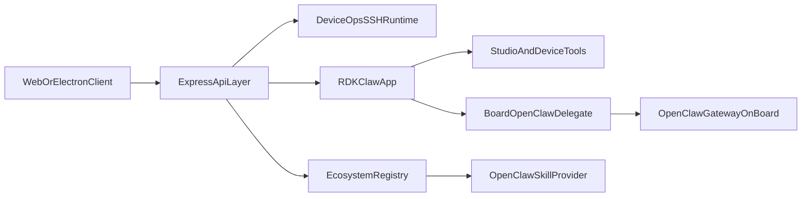

# RDK Studio 项目全景 Review（汇报稿）

## 1. 项目定位（给业务与管理层）

RDK Studio 是面向机器人设备研发与运维的一体化 AI Native 工作台，目标是把“设备接入、能力验证、AI 协作、板端部署”整合到一个 Web/Electron 统一入口中，降低研发门槛与现场运维成本。

核心价值可以浓缩为三点：
- 设备侧：把 SSH/文件/服务诊断等高频运维动作标准化，缩短问题定位链路。
- AI 侧：把对话、工具调用、审批、会话同步整合为同一工作流，提升任务完成率。
- 交付侧：支持桌面打包与板端 OpenClaw 对接，形成“开发到落地”的闭环。

## 2. 全景架构（给技术与架构评审）

模块边界：
- 前端层：`src/`（React 19 + Context 状态管理 + SSE/Socket 客户端）。
- 后端层：`server/index.ts`（统一 API、SSE、Socket.IO、设备路由、RDKClaw/Feishu/生态挂载）。
- 智能体层：`server/rdkclaw/` 与 `server/agent/`（Agent 编排、工具体系、策略人格、审批机制）。
- 设备执行层：`server/managers/OpenClawDeploymentManager.ts` 与 `server/agent/tools/rdk-tools.ts`（SSH 执行、OpenClaw 生命周期、板端交互）。
- 生态层：`server/ecosystem/`（技能发现、注册、板端技能下发）。

## 3. 关键业务流（端到端）

### 3.1 设备接入流

1) 前端触发设备连接：`connectDevice()`  
2) 后端执行 SSH 连通校验并落盘设备信息  
3) 前端在 `sessionStorage` 记住设备密码并通过 `x-device-password` 透传  

对应实现：
- `src/api.ts`：`rememberDevicePassword` / `request()` 自动加 `x-device-password`
- `README.md`：设备成功后写入 `data/devices.json`

### 3.2 AI 对话主链路（当前主路径）

1) 前端 `streamAgentChat()` 请求 `POST /api/agent/chat`（SSE）  
2) 后端 `rdkclaw.streamChat()` 编排工具与执行策略  
3) 事件流（`meta/text/tool_start/tool_result/approval_required/...`）回推前端  
4) 前端 `useAIChatStore` 渲染为时间线、审批卡片、执行状态  

对应实现：
- `src/api.ts`：`streamAgentChat` SSE 解析
- `server/index.ts`：`/api/agent/chat`
- `server/rdkclaw/app.ts`：`streamChat`、工具装配、审批与事件映射

### 3.3 板端 OpenClaw 生命周期流

通过 `/api/devices/:id/openclaw/*` 统一入口支持：
- check / prepare / install / upgrade / uninstall
- status / health / logs / model-test / restart-gateway
- pairing 与 wifi 管理

对应实现：
- `server/index.ts`：OpenClaw 相关路由群
- `server/managers/OpenClawDeploymentManager.ts`：SSH 命令执行与状态探测

## 4. 技术栈与工程实现风格

- 前端：React 19 + TypeScript + Vite 6，状态以 Context Store 组合为主。
- 后端：Express + Socket.IO + ws + ssh2，集中式服务入口。
- 桌面：Electron 35 + electron-builder，多平台打包。
- AI：`@mariozechner/pi-ai` + 自研工具生态（RDK 工具、附件工具、Web/Forum 工具、Studio 工具）。
- 样式：CSS 分层（shell/pages/tokens），无重型样式框架绑定。

## 5. 现状优点（可对外讲）

- 一体化程度高：设备连接、调试、对话、部署在同一工作台完成。
- 对实机友好：README 有完整联调与排障路径，降低新人上手成本。
- 桌面适配完整：`desktop` 联合启动链、`build:desktop:*` 多平台产物明确。
- AI 与设备结合紧密：RDKClaw 支持“本地工具 + 板端委派”混合执行。

## 6. 现状问题（Review 发现）

### 高优先级

- 自动化质量门禁偏弱：根 `package.json` 无 `test` 脚本，主工程缺少统一测试基线。

### 中优先级

- `server/index.ts` 职责过重，API/实时链路/渠道逻辑集中，后续迭代回归面较大。
- `/api/agent/chat` 与 `/api/chat` 双轨并存，长期会增加行为理解与维护成本。

### 低优先级

- 前端状态门面较大（`useAIChatStore`、`useAppState`），规模增长后需防止边界进一步耦合。

## 7. 建议的汇报表达方式（可直接讲）

- 一句话：RDK Studio 已形成“设备工作台 + AI 编排中枢 + 板端能力执行”的闭环雏形。
- 两个重点：  
  1) 现阶段可支撑研发与现场运维的高频场景。  
  2) 下一阶段要补齐质量门禁和服务边界治理，确保规模化可维护。
- 三个结论：  
  1) 架构方向正确；  
  2) 关键能力可用；  
  3) 工程化深水区在测试与解耦。

## 8. 关键证据文件

- `README.md`
- `package.json`
- `server/index.ts`
- `server/managers/OpenClawDeploymentManager.ts`
- `src/api.ts`
- `src/hooks/useAIChatStore.ts`
